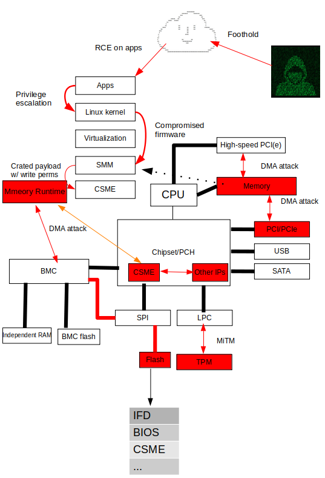

# Bootkit Showcase: Real-World Examples of Infrastructure Security Threats
Bootkits are a type of malware that infects the boot process of a computer, allowing attackers to gain persistent access and control over the system. Despite their potential to cause significant damage, many people, including security professionals, may not be familiar with the threat they pose to infrastructure security. This repository is a curated collection of bootkit samples that demonstrate the potential danger posed by this type of malware. These samples are provided for educational purposes and are intended to raise awareness of the threat landscape of bootkits, as well as to help security professionals better understand how to defend against them. All of them are from real-life attacks so be cautions about tweaking the sample for research or eductional purposes.

Password: danger

## Bootkits has been found in the wild

| Malware/Bootkits | Disclosure date | 1st blood   | Infection type |Targeted OS | Malware “vendor” |
|:--------------------:|:-----------------:|:-------------:|:----------:|:-------------------:|:--------:|
|[Vector-EDK (Leaked source code)](https://github.com/hackedteam/vector-edk) |2015 |2014 |DXE |? |HackingTeam |
|[DerStarke](https://wikileaks.org/ciav7p1/cms/page_3375125.html) |2016 |2013? |DXE |Windows/Linux/MacOS | Vault7 |
|[QuarkMatter](https://wikileaks.org/ciav7p1/cms/page_21561431.html) |2016 |2013? |ESP |Windows/Linux | Vault7 |
|[LoJaX](https://www.eset.com/fileadmin/ESET/US/resources/datasheets/ESETus-datasheet-lojax.pdf) |2018 |2017 or earlier |DXE | Windows  | APT28 |
|[TrickBot/TrickBoot](https://eclypsium.com/2020/12/03/trickbot-now-offers-trickboot-persist-brick-profit/) |2020 |2017 |DXE |Windows |N/A |
|[FinSpy](https://securelist.com/finspy-unseen-findings/104322/) |2021 |2011 |MBR/ESP |Windows/Linux/MacOS |N/A |
|[ESPecter](https://www.welivesecurity.com/2021/10/05/uefi-threats-moving-esp-introducing-especter-bootkit/) |2021 |2012/2020 |MBR/ESP |Windows |N/A |
|[Rovnix (Leaked source code)](https://github.com/m0n0ph1/Win64-Rovnix-VBR-Bootkit) |2011 |? |MBR/VBR |Windows |N/A |
|[MosaicRegressor](https://securelist.com/mosaicregressor/98849/) |2020 |? |DXE |Windows |N/A |
|[Implant.ARM.iLOBleed.a](https://threats.amnpardaz.com/en/2021/12/28/implant-arm-ilobleed-a/) | 2021 | ? | BMC | Linux | N/A |
|[MoonBounce](https://securelist.com/moonbounce-the-dark-side-of-uefi-firmware/105468/) based on Vector-EDK | 2021 | ? | DXE | Windows | APT41 |
| [Conti leaked chat](https://github.com/hardenedvault/bootkit-samples/blob/master/osint/conti_leaked_chat.md) | 2021 | ? | CSME via undocumented HECI, SMM | Windows/Linux/? | Conti group |
| [CosmicStrand](https://securelist.com/cosmicstrand-uefi-firmware-rootkit/106973/) | 2022 | [2017](https://bbs.360.cn/thread-14959110-1-1.html) | DXE | Windows/? | N/A |
| [BlackLotus](https://www.welivesecurity.com/2023/03/01/blacklotus-uefi-bootkit-myth-confirmed/) | [2022](https://www.bleepingcomputer.com/news/security/malware-dev-claims-to-sell-new-blacklotus-windows-uefi-bootkit/) | 2022 | ESP | Windows | N/A |
| [Bootkitty](https://www.welivesecurity.com/en/eset-research/bootkitty-analyzing-first-uefi-bootkit-linux/) | 2024 | 2024 | ESP | Linux | N/A |

## Massive exploitation
| Vulnerability | Target |
|:--------------------:|:-----------------:|
|[CVE-2022-21894](https://github.com/Wack0/CVE-2022-21894)| UEFI Secure Boot |
|[LogoFAIL (CVE-2023-40238)](https://www.binarly.io/blog/logofail-exploited-to-deploy-bootkitty-the-first-uefi-bootkit-for-linux) | UEFI |

## Threat model - "Know your enemy"

HardenedVault is mainly focus on figuring out the infection stage of bootkits, which is crucial to work on security features for defense in [VaultBoot](https://github.com/hardenedvault/vaultboot). A typical malicious firmware may check if the security protections are set and implant (write) the bootkits into SPI flash if they're not set correctly (e.g. Write protection is not set, etc). If security protections are set properly, malicious firmware might achieve the persistent by utilizing exploits (e.g. CVE-2014-8273). Bootkits usually targeted MBR/ESP in the early 2010s, but as the cost of firmware attack decreased rapidly, the modern bootkits started to target DXE or even PEI.

## Reference

* [What every CISO and security engineer should know about Intel CSME - 202107](https://hardenedvault.net/blog/2021-07-16-ciso-seceng_csme/)
* [CSME security](https://github.com/hardenedlinux/firmware-anatomy/blob/master/hack_ME/me_info.md)
* [UEFI/SMM security](https://github.com/hardenedlinux/firmware-anatomy/blob/master/hack_ME/firmware_security.md)

